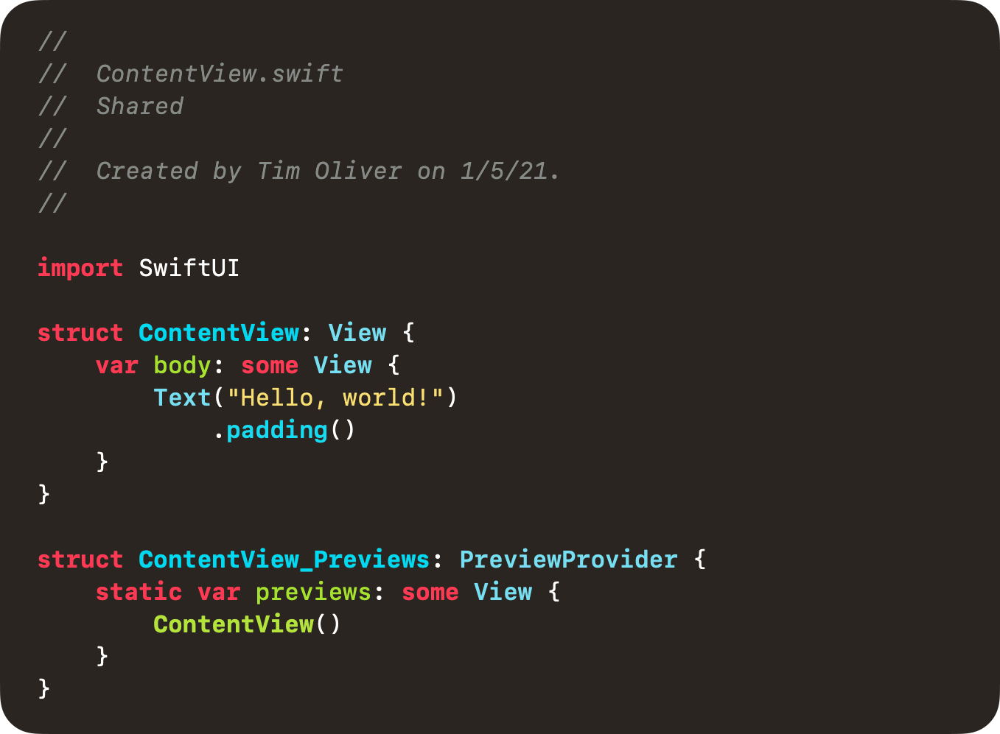

# Yozora Redux - Xcode Color Theme



Yozora Redux is my own personally tailored variant of [Yozora](https://github.com/tursunovic/xcode-themes) that I use in [Xcode]. I've mostly just tweaked the sizing, some of the weighting, and the coloring to lean more towards Monokai, which was made famous in [Sublime Text](https://www.sublimetext.com)

I've made this repo mainly so I keep track of this theme between Mac migrations, but to also freely offer it if anyone else is interested in using it. :)

## Installation

### Easiest Way

1. Install [ThemeInstaller](https://apps.apple.com/au/app/themeinstaller/id1148208665?mt=12) from the Mac App Store.
2. [Download this repo](https://github.com/TimOliver/YozoraRedux/archive/refs/heads/main.zip), and unzip it.
3. Open `Yozora Redux.xccolortheme` with ThemeInstaller.
4. Restart Xcode if it is currently open.
5. In Xcode, go to `Preferences` > `Themes` and select `Yozora Redux` from the list of themes.


### Manual Way

1. [Download this repo](https://github.com/TimOliver/YozoraRedux/archive/refs/heads/main.zip), and unzip it.
2. In Terminal, run the following command to generate the Xcode themes directory in the appropriate place:
```
mkdir ~/Library/Developer/Xcode/UserData/FontAndColorThemes
```
3. Drag `Yozora Redux.xccolortheme` into this folder, and restart Xcode if it's already open.
4. In Xcode, go to `Preferences` > `Themes` and select `Yozora Redux` from the list of themes.

## License

I've released all of my claims to this theme. Please feel free to modify, reproduce and republish as much as you wish.
